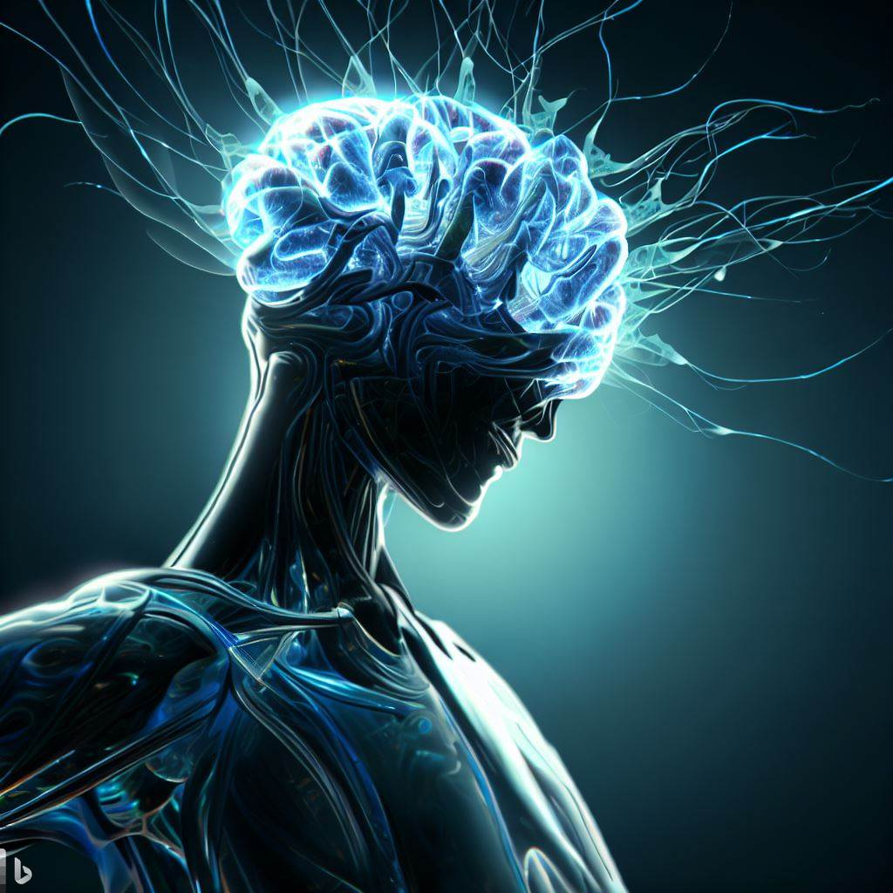
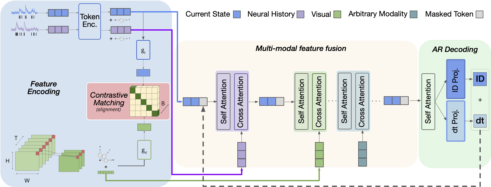
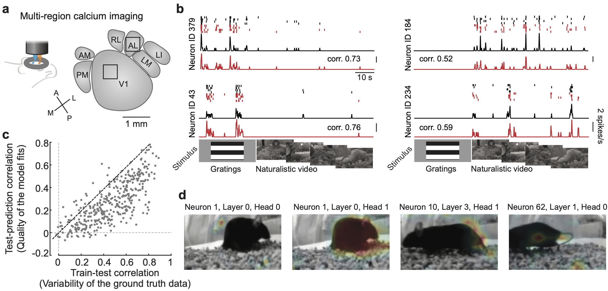
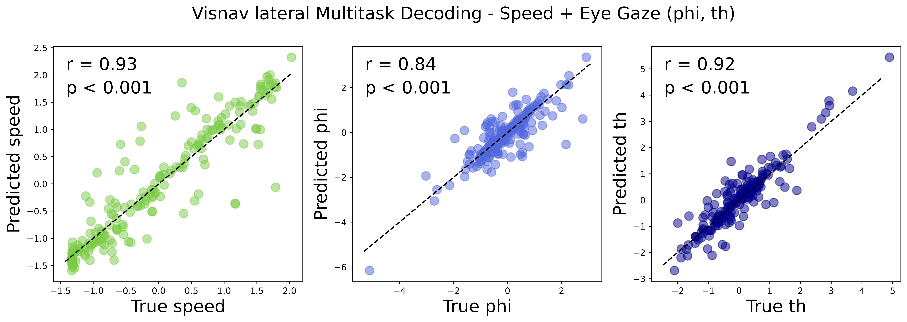

# Neuroformer 
### A GPT based multi-modal, multi-task transformer model for pretraining and downstream inference involving brain data.
<!-- <p align="center">
  
</p> -->

<!--  -->

<!-- <p align="center">
### A GPT based multi-modal, multi-task transformer model for generative pretraining and downstream inference involving brain data.
</p> -->


<p align="center">
  
</p>

**Need help using the model with your data, or have general questions? Feel free to contact antonis@ucsb.edu.**

## Installation

```
conda create -n neuroformer python=3.11
conda activate neuroformer
bash setup_env.sh
```

The Smith Lab has open-sourced two datasets for use with this model. Special thanks to Yiyi Yu and Joe Canzano 🙂

- `V1AL`: Neuronal activity from the primary visual cortex and a higher visual area (V1 + AL), recorded from awake mice viewing visual stimuli.

- `lateral` *(visnav)*: Recordings from the lateral visual cortex, spanning V1 and multiple higher visual areas, from mice engaged in a visually-guided navigation task. This dataset includes additional behavioral variables such as speed, and eye gaze (phi, th).


## Pretraining
**To pretrain on the visnav dataset without any additional modalities, you can run the following code:**

```
python neuroformer_train.py \
       --dataset lateral \
       --config configs/Visnav/lateral/mconf_pretrain.yaml
``` 

**To pretrain using all additional modalities, just uncomment the *modalities* section in the config.yaml, this should get you familiar with the config!**


<p align="center">
  
</p>

You can jointly pretrain the model using the spike causal masking (SCLM) objective and any other downstream task. The trainer will automatically save the model that does best for each corresponding objective (if you also include a holdout dataset). For example model.pt (normal pretraining objective), model_speed.pt, etc.

## Contrastive Learning

To incorporate contrastive learning, just specify it in the config. You can align an arbitrary number of modalities. Here's an example aligning spikes `id`, `frames` and `speed` from the block `behavior`:

```yaml
contrastive:
  contrastive: true
  vars: ['id', 'frames', {'behavior': 'speed'}]
  clip_embd: 512
  clip_temp: 0.5
```


## Integrating your own data

For a closer look at the data format, refer to the [`neuroformer.datasets.load_visnav()`] function (used for example in the [`neuroformer_train.py`](./neuroformer_train.py)). 

### Data Dictionary

```python
{
    'data': {
        'spikes': (N_neurons, N_timesteps),  # np.ndarray, required key
        'frames': (N_frames, N_timesteps),   # np.ndarray, optional key
        'behavior variables': (N_timepoints,),  # np.ndarray,
    'intervals': (N_timepoints,),  # np.ndarray, Denoting all intervals/time bins of the data. Used to split the data into train/val/test sets.
    'train_intervals': (N_timepoints,) ,  # np.ndarray, The corresponding train intervals.
    'test_intervals': (N_timepoints,) ,   # np.ndarray, The corresponding test intervals.
    'finetune_intervals': (N_timepoints,) ,  # np.ndarray, The corresponding finetune intervals (very small amount).
    'callback': callback() # function
}
```

`data['spikes']`: Represents neuronal spiking data with dimensions corresponding to the number of neurons and timesteps.

`data['frames']`: If provided, it denotes stimulus frames that align with the neuronal spiking data.
data['behavior variables']: Optional key that represents behavioral variables of interest. The naming for this key can be customized as required.

`data['behavior']`: If provided, denotes the behavioral variable of interest (e.g. speed, phi, thi, etc). You can name this key as per your requirements and specify its usage in the config file [(see below)](#modalities-and-task-configuration).

`intervals`: Provides a breakdown of time intervals or bins in the dataset.
train_intervals, test_intervals, finetune_intervals: Represent the segments of the dataset that will be used for training, testing, and fine-tuning respectively.

`callback`: This function is passed to the dataloader and parses your stimulus (for example how to index the video frames) according to the relationship it has to your response (spikes). It is designed to integrate any stimulus/response experiment structure. Typically requires only 4-5 lines of code; refer to comments inside `visnav_callback()` and `combo3_V1AL_callback()` inside [`datasets.py`](neuroformer/datasets.py) for an example.


## Modalities and Task Configuration

In your config file, [like this one](/share/edc/home/antonis/neuroformer_clean/Neuroformer/configs/Visnav/lateral/mconf_predict_all.yaml), you can specify additional modalities other than spikes and frames. For example behavioral features. The model will *automagically* create add/remove the necessary layers to the model. Additionally, you can specify any downstream objective, and choose between a ***regression*** or ***classification*** task.

Here's what each field represents:

```yaml
Modalities: Any additional modalities other than spikes and frames.

Modality Type: The name of the modality type. (for example behavior)

Variables: The name of the modality.

  Data: The data of the modality in shape (n_samples, n_features).
  dt: The time resolution of the modality, used to index n_samples.
  Predict: Whether to predict this modality or not. If you set predict to false, then it will not be used as an input in the model, but rather to be predicted as an output.
  Objective: Choose between regression or classification. If classification is chosen, the data will be split into classes according to dt.
```


## Finetuning
<div style="text-align: center;">
    <p align="center">
      
      <br>
      <figcaption style="font-size: 0.9em; color: grey;">Speed decoding of Neuroformer (green) vs. baseline models. </figcaption>
    </p>
</div>


To finetune the model on one of the behavioral variables (speed, phi, thi), you can run the following code:
```
python neuroformer_train.py --dataset lateral \
                            --finetune  \
                            --loss_brop speed phi th \
                            --config configs/NF/finetune_visnav_all.yaml
```

`--loss_bprop` tells the optimizer which losses to backpropagate.  
`--config` Here only difference between the two is adding Modalities.Behavior.Variables.(Data, dt, Predict, Objective) to the config file.

## Inference

**To generate new spikes:**
```
python neuroformer_inference.py --dataset lateral \ 
                                --ckpt_path "model_directory" \ 
                                --predict_modes speed phi th
```

<div style="text-align: center;">
    <p align="center">
      
      <br>
      <figcaption style="font-size: 0.9em; color: grey;">Multitask decoding of single Neuroformer jointly Trained on <strong>Speed</strong> and <strong>Gaze (phi, thi).</strong></figcaption>
    </p>
</div>


The `neuroformer.utils.decode_modality()` function can be used to generate predictions for any of the behavioral variables. **See [`neuroformer_inference.py`](./neuroformer_inference.py) for an example**.

```python
# block_type = behavior, modality = speed
preds = decode_modality(model, dataset, 
                 modality='speed', 
                 block_type='behavior',
                 objective=config.modalities.behavior.speed.objective)
                           # 'regression' or 'classification'
```


Note that if you want to generate predictions for a variable that was not used in the pretraining, you will need to add it to the config file (and preferably **finetune** on it first).